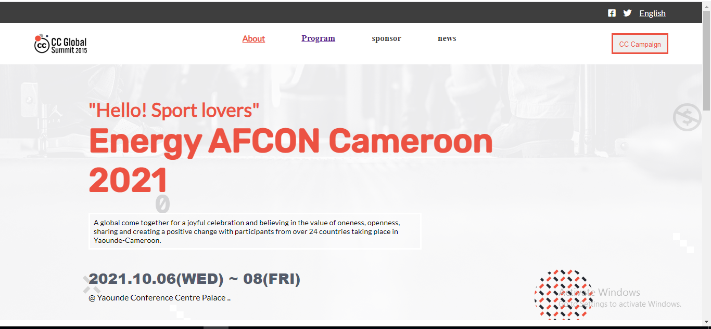
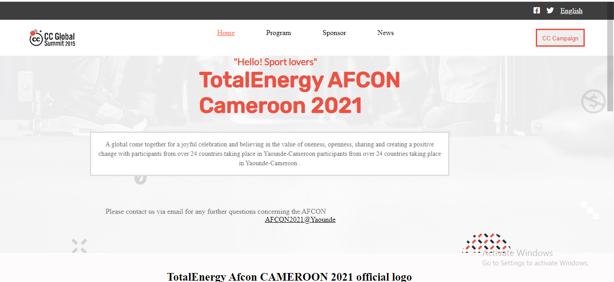
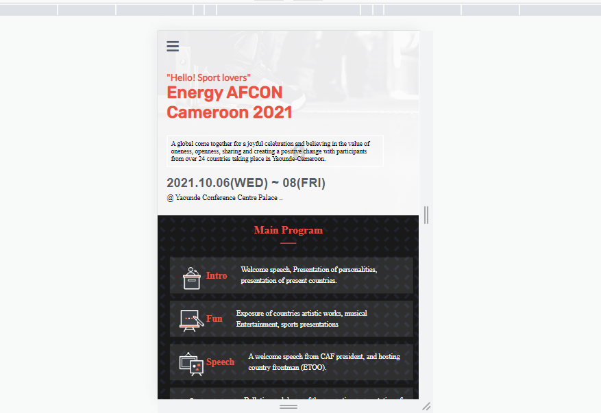
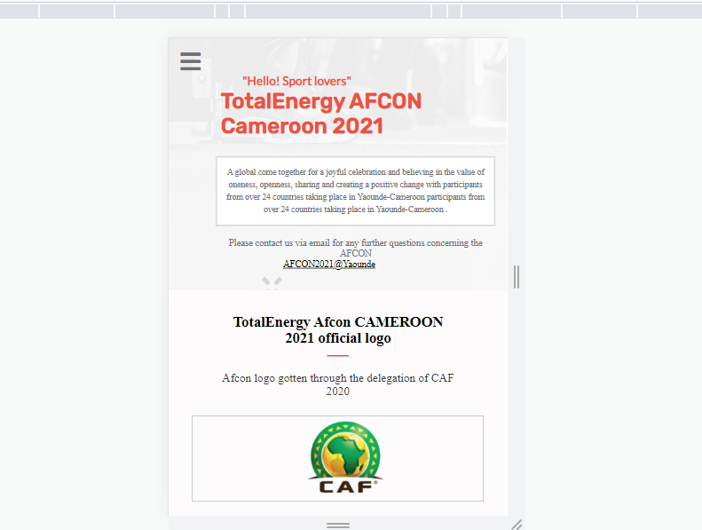

# CAPSTONE I
A SPORT CONFERENCE HELD IN PREPARATIONS FOR THE AFCON 2022, designed using https://www.behance.net/gallery/29845175/CC-Global-Summit-2015 

> CAPSTONE1
Designed a conference page (the home and the about section). in contains information about a conference held in preparation for the afcon 2022. It has both the desktop and mobile version and they  work well responsively. 
Hope you will like what you see!

This CAPSTONE consist of the various sections

1 The toolbar section
2 The headline section
3 The introduction section
4 The main program section
5 Different speakers and their information
6 More information and tool bar to navigate the project

## Built With

- Html
- Css
- javascript
- Bootstrap
- VS code

[Live Demo Link](https://tufoinnkuo10.github.io/Capstone-1/

#To get a local copy up and running , the following steps might be necessary
- Open your terminal
- get the clone link
- Run git clone and paste the link above
- chose a code editor
- Open the folder on a code editor
- Create a new branch and make the desired changes on it
- And finally you can demand for a pull request if it is worth it.

### Prerequisites

- Internet connection
- github and git
- 250mb of storage
- working space

### Setup

RUN git clone https://git@github.com:tufoinnkuo10/Capstone-1.git

### Install

The user does not have to install anything

### Usage

Run the index.html

### Run tests 

No test required

## Authors

👤 **Author**
- Name: Tufoin Nkuo
- GitHub: [@tufoinnkuo10](https://github.com/tufoinnkuo10)
- Twitter: [@itztenten](https://twitter.com/itztenten)
- LinkedIn: [LinkedIn](https://www.linkedin.com/in/tufoin-nkuo-3b272320b)

## 🤝 Contributing

Contributions, issues, and feature requests are welcome!

Feel free to check the [issues page](../../issues/).

## Show your support

Give a ⭐️ if you like this project!

## Acknowledgments

- Thanks to the Microverse team.
- Thanks to the amazing @Cindy shin design

## 📝 License

This project is [MIT](./MIT.md) licensed.

